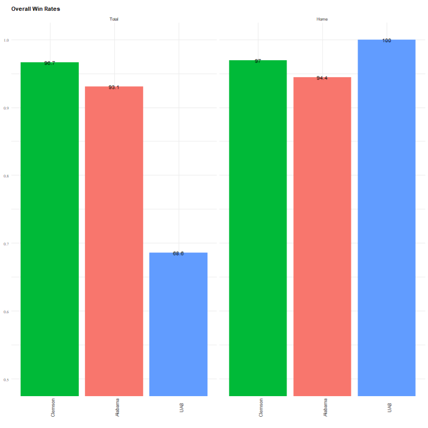
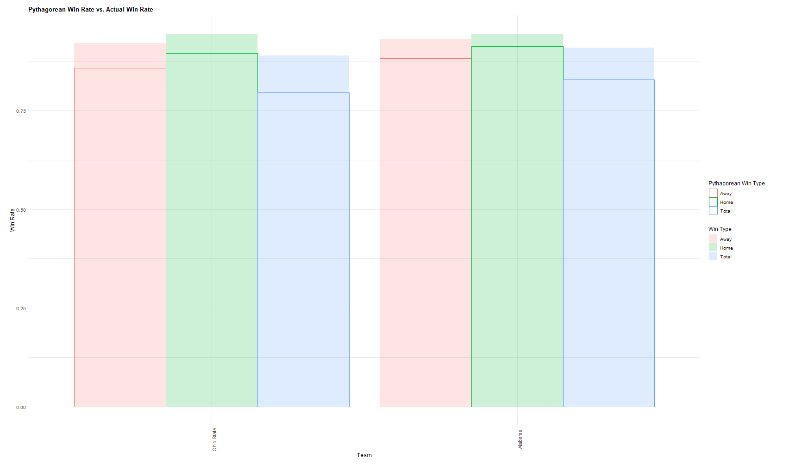

# Exploring College Football

Hi! My name is Ying Dai and I love Oregon State football.

College football is an exciting past time, but is notoriously complex for newcomers to fully understand.
Not only are the rules of play very intricate, but there are over 130 top teams to keep track of!

This app is for exploring different win rates in American D1 college football so that prospective college football fans can be better informed when picking a favorite team!

Check out the deployed app [here](https://yingdai1130.shinyapps.io/shiny/?_ga=2.241989698.1730850034.1642134703-924289114.1642134703), hosted on shinyapps.io

# Visualization Examples

Here is an example of a bar plot comparing win rates between some top performing teams!

We can see here that Clemson has a higher overall win rate than either Alabama or UAB, but UAB has an undefeated record at home.

Here is an example of a bar plot comparing Pythagorean win rate to actual win rate.

As we can see, Ohio State and Alabama are pretty strong and they are over-performing in season 2019 since the Pythagorean win rate is higher than the actual win rate.
